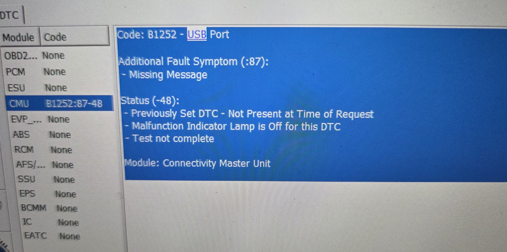

# CMU B1252:87 seen after the change, and why it is unrelated

After writing `2BE1 E2E6 807D` the only code on the car was on the CMU (Mazda Connect):

- `B1252:87-48` – "USB Port – Missing Message", status `48` = confirmed + not yet tested this cycle.
- After clearing and one ignition cycle: `B1252:87-0B`, status `0B` = test failed + failed this cycle + confirmed. Actively failing.
- Still `0B` with nothing plugged into either USB port.
- Android Auto through a wireless dongle on the main port works while the code is active.
- The secondary USB port in the console had been dead since before any of this work.
- No DTC baseline from before the write exists (lesson learned, see `safety.md`).

## What the code means (ND workshop manual)

Mazda's ND manual (DTC B1252:87, CMU) defines it as *"Communication error with auxiliary
jack/USB port/SD card slot hub"*, detected when, with ignition ON, *"the CMU cannot receive a
signal from the auxiliary jack/USB port/SD card slot hub"*. The test completes within about 7 s
of ignition ON. No fail-safe.

Listed possible causes: hub connector/terminal, CMU connector/terminal, open circuit on the
two signal wires between CMU and hub (CMU 4B–hub 2B, CMU 4D–hub 2D), hub malfunction,
CMU malfunction. The later Mazda3 revision of the same page adds "software error – USB driver
malfunction" and a software-reset step (diagnostic-assist code 08) before hub replacement.

Sibling codes on the same link: `B1252:09` (hub supply on CMU 4C outside 4.8–5.2 V) and
`B1252:1D` (over-current ≥ 550 mA). So the console unit is a bus-powered USB hub with its own
controller that must enumerate on the CMU's upstream port; `:87` means it never answers.
Both console ports hang off that one hub.

Diagnostic-assist code 61 ("Vehicle Signal") in the CMU hidden menu shows the live
"HUB1 signal input condition", which is a direct way to see whether the CMU sees the hub.

## Why the instrument-cluster As-Built cannot be the cause

- The CMU does read vehicle-specification data from the IC over CAN, but only at automatic
  configuration after a CMU replacement, and the stored items are just "Destination" and
  "CMU Types". A mismatch there sets `U2300:54/55`, not `B1252`.
- `B1252:87` is a physical-link check between the CMU's USB host and the console hub. The IC
  region byte has no path into it. No manual page, bulletin or forum report links the two.
- The dead secondary port pre-dates the work and is by itself the classic sign of a partially
  failed hub (a Russian CX-5 owner with exactly "lower port dead, upper port works" had the
  hub replaced under warranty; the dealer's verdict was a burnt hub).

A rollback A-B-A test (write the original line back, clear, sleep cycle, rescan) would
settle it formally. It was not done because the two symptoms already had an independent
explanation; if you are in the same situation and want certainty, it costs about 15 minutes.

## Collected scenarios for a persistent B1252:87

Ranked for this car's symptoms (secondary port dead, main port passes data, code active with
nothing plugged in). Sources are forum reports and the manual; none are ND-specific except where noted.

| # | Scenario | Evidence | Fit here |
|---|---|---|---|
| 1 | Hub PCB failure – burnt/melted traces under the USB chips, or one port's circuit dead | Mazda3 BM owner with B1252:87: old hub had melted traces, new hub fixed it [D1]. CX-5 owner with lower port dead: dealer replaced hub as burnt [D2]. CX-5 KE: both ports dead, used OEM hub fixed it [D3]. Several Mazda3/CX-5 owners: one port on a genuine hub dies after years [D4] | High |
| 2 | Open or poor contact on the CMU–hub link (4B/2B, 4D/2D), or a connector left unplugged after console/CMU work; diagnostic-assist code 61 then shows "HUB1: off" | Manual's first-listed causes; "the connector had simply fallen out" (Mazda6 GJ) [D5]; hub power cable not plugged in after CMU swap [D6]; connectors disturbed by collision repair [D7] | High if the console has been apart |
| 3 | Non-genuine or mismatched hub – clone or wrong-generation hubs pass the phone port but never answer the CMU; permanent B1252:87 that survived a new CMU and two hubs until a genuine Japanese hub was fitted | Professional diagnostics forum, CX-9 [D8]; BP-2019 hub in a BM-2015 giving "B125287 USB 1 Port – Missing Message" [D9]; eBay TK78 hub breaking nav/SD [D10]; AliExpress hubs degrading after weeks on Mazda3 and ND [D11] | Medium – check the label on the hub |
| 4 | Firmware / hub pairing – CMU updated 56→70 with the old hub, or a CarPlay hub fitted before the firmware supported it, leaves the USB undetected with this exact code | Mazda3 2014 after 70.00.100 update [D12]; 2017 ND with AliExpress kit and mixed 70.x images [D13]; Mazda's retrofit notes require ≥ 70.00.100 before fitting the hub | Low here (firmware unchanged), high if you ever swap hub or firmware |
| 5 | Hub power/ground loss – INTERIOR 15 A, MIRROR 7.5 A (ACC) fuse, ground G08, or ACC relay feed | ND wiring diagram (hub pins 1L +B, 1K ACC, 1A ground). Fuse-pull / battery-disconnect "fixes" reported on CX-5 [D5] | Low–medium; would usually also kill charging |
| 6 | CMU USB-host driver fault – manual lists "USB driver malfunction"; fix is the assist-code 08 software reset (or ENTER 2 clear in the diag menu), then CMU replacement if it recurs after a new hub | Mazda3 BM manual revision; owners clearing lingering codes from the diag menu [D4] | Low–medium, cheap to try |
| 7 | CMU-side USB host failure – genuine hub replaced, HUB1 still blank, fixed only by another CMU | CX-9 2018 [D14]; Mazda3 2014 and CX-5 2018 where CMU and hub were both replaced and the code stayed (unresolved) [D15] | Low, last resort |
| 8 | Worn USB-A contact springs / weak lower port on ND | ND owners (minkara, ameblo); JDM S-grade port unit KD45-66-9U0 replaced | Explains a flaky port, not a hub that never enumerates |
| 9 | Phone-side loops (Android power draw, iPhone VPN/profile), wireless AA dongle re-enumerating at boot | Owner reports of connect/disconnect loops [D4]; none reported setting B1252:87 | Ruled out here: code persists with nothing plugged in |
| 10 | Low battery voltage / post-update transient | Mazda service alert for Gen-7 cars lists B1252:87 among low-voltage codes and prescribes a 30 s battery disconnect [D16]; CMU "needs a few hours after an update" reports | Low; battery was fine during this work |
| 11 | IC As-Built / region code | Nothing supports it | Very low |

Diagnostic trick from owners: swap the two USB plugs at the CMU end to see whether the dead port follows the hub or the CMU port [D4].

Not found in any language: a documented case of `B1252:87` caused by liquid ingress, a blown fuse,
or phone over-current (that would be `:1D`); any ND-specific `B1252:87` case diagnosed to completion;
any FORScan-forum thread on the Mazda version of this code. NHTSA complaints for 2017–2020 MX-5
contain no USB/hub complaints, so the OEM ND hub is not a known mass-failure item; the recurring
stories are clone hubs, firmware mismatch and single-port failures on Mazda3/CX-5/CX-9.

## Hub part numbers seen in parts listings (not verified on this car)

- `N243-66-9U0` (→ `-9U0A/B`): ND 2015–2018 hub, 2×USB + AUX.
- `N314-66-9U0`: ND from 2019 with factory CarPlay/AA wiring.
- `TK78-66-9U0C` (later `-9U0D/E`): Mazda's CarPlay/AA retrofit hub for older Mazda Connect cars; "Made in Japan" and "Made in China" label variants exist, and clones are common.
- `KD45-66-9U0`: single-USB unit on some JDM grades.

## What to do about it

Follow the manual's order: inspect and reseat the hub and CMU connectors, check continuity of
the two signal wires and 5 V on the supply wire, clear the code, ignition ON ≥ 7 s, re-read.
Try the assist-code 08 software reset. If the code returns, replace the hub with a genuine
unit matching the car's year. The code sets no warning lamp and has no fail-safe, so driving
with it is harmless; you just keep a dead secondary port.

## FORScan status byte decoding (ISO 14229-1)

| Bit | Meaning |
|---|---|
| 0 | testFailed |
| 1 | testFailedThisOperationCycle |
| 2 | pendingDTC |
| 3 | confirmedDTC |
| 4 | testNotCompletedSinceLastClear |
| 5 | testFailedSinceLastClear |
| 6 | testNotCompletedThisOperationCycle |
| 7 | warningIndicatorRequested |

`48` = bits 3+6 (history, not yet re-tested). `0B` = bits 0+1+3 (failing now).

## Sources

- Manual: ND MX-5 workshop manual, DTC B1252:87 (CMU): https://www.mx5manual.com/page.html?p=workshop&s=SC3351&docid=SM355853 ; diagnostic-assist menu: https://www.mx5manual.com/page.html?p=workshop&s=SC3351&docid=SM355828 ; hub removal: https://www.mx5manual.com/page.html?p=workshop&s=SC3351&docid=SM356305 ; Mazda3 BM revision with the software-reset step: https://mazda3.neocities.org/esicont/srvc/html/id0902n7105300
- Retrofit-kit instructions and firmware prerequisite (NHTSA): https://static.nhtsa.gov/odi/tsbs/2018/MC-10144323-9999.pdf , https://static.nhtsa.gov/odi/tsbs/2019/MC-10155442-0001.pdf
- [D1] drive2.ru, Mazda3 BM, B1252:87, melted traces in the old hub: https://www.drive2.ru/l/663226514459877331/
- [D2] mazdagroup.ru, CX-5, lower USB dead, hub replaced under warranty: https://mazdagroup.ru/threads/kto-podskazhet-kak-snjat-blok-usb-i-sd-i-pochemu-mozhet-ne-rabotat-nizhnij-usb-verxnij-rabotaet-i-fleshki-vidit-i-tel-zarjazhaet-a-nizhnij-ne-figa-ne.40444/
- [D3] cx5-forum.de, CX-5 KE, both ports dead, used OEM hub: https://www.cx5-forum.de/threads/usb-anschlüsse-defekt.9246/
- [D4] mazda3revolution, top port dead / plug-swap test / diag-menu clearing: https://www.mazda3revolution.com/threads/top-usb-port-stopped-working.219074/ , https://www.mazda3revolution.com/threads/top-usb-port-not-working-new-carplay-hub.230647/ ; mazdas247 CX-5 CarPlay port failure: https://mazdas247.com/forum/threads/2020-cx-5-gt-carplay-usb-port-failure-after-only-4-000-miles.123874112/
- [D5] mazdagroup.ru, Mazda6 GJ connector fallen out; CX-5 fuse-pull reset: https://mazdagroup.ru/threads/muzhiki-zdorova-otkazalis-rabotat-oba-usb-porta-v-podlokotnike-aux-i-bljutuz-rabotajut-v-poiske-gruppe-reshenie-ne-nashel-predoxraniteli.26208/ , https://mazdagroup.ru/threads/mazda-cx-5-ne-rabotaet-usb-ni-odna-fleshka-chto-mozhet-byt.36112/
- [D6] mazda3revolution, hub power cable not plugged in after CMU swap: https://www.mazda3revolution.com/threads/cmu-replaced-no-nav-rvc-or-usb.241309/ , https://www.mazda3revolution.com/threads/2015-usb-hub-does-not-receive-power.247748/
- [D7] mazdaklan.cz, B1087:87 + B1252:87 after collision repair: https://www.mazdaklan.cz/threads/infotainment-prestal-fungovat.5582/
- [D8] carmasters.org, CX-9, clone hub, fixed by genuine Japanese hub: https://carmasters.org/topic/68031-b125287-b12b887-cmu-ошибка/
- [D9] mazda3revolution, BP hub in BM car: https://www.mazda3revolution.com/threads/installing-a-carplay-usb-hub-from-the-new-mazda-3-bp-2019-to-the-mazda-3-bm-2015.241361/
- [D10] mazda3revolution, eBay TK78 hub broke nav: https://www.mazda3revolution.com/threads/mazda-nav-does-not-work-after-installing-aa-carplay-hub.244127/
- [D11] mazda3revolution HMYC hub: https://www.mazda3revolution.com/threads/bought-and-installed-the-auto-android-hub-from-hmyc-brand.255635/ ; mx5oc, ND 2017 AA greyed out on second-hand hub: https://forum.mx5oc.co.uk/t/android-auto-greyed-out/150334 ; Japan vs China label: https://www.mazda3revolution.com/threads/tk78-66-9u0c-usb-hub-made-in-china-vs-made-in-japan-significant-difference.245145/
- [D12] mazdas247, USB not detected after 56→70 update: https://mazdas247.com/forum/threads/usb-not-detected-after-firmware-update.123884135/
- [D13] mazdas247, 2017 ND CarPlay retrofit issues: https://mazdas247.com/forum/threads/apple-carplay-issues-2017-nd-mx-5-help.123877211/
- [D14] mazdas247, CX-9 fixed by another CMU: https://mazdas247.com/forum/threads/cx-9-usb-issues.123878004/
- [D15] reddit, CMU and hub both replaced, code stayed: https://www.reddit.com/r/mazda/comments/18evzfs/mazda_3_2014_head_unit_code_b125287/ , https://www.reddit.com/r/CX5/comments/1q9di59/dtc_error_b125287_usb_port_1missing_message/
- [D16] Mazda service alert SA-029/20 (Gen-7, TCU version of the code, low-voltage list): https://static.nhtsa.gov/odi/tsbs/2020/MC-10177007-0001.pdf
- ND port wear (Japanese): https://minkara.carview.co.jp/userid/1516724/car/2047083/6693890/note.aspx , https://ameblo.jp/expanded-universe/entry-12948069234.html ; lower-port power weakness: https://minkara.carview.co.jp/car/mazda/roadster/qa/unit190966/
- JDM firmware-update hub recognition loss: https://minkara.carview.co.jp/userid/629703/car/2032394/3492314/note.aspx , https://minkara.carview.co.jp/userid/2644749/car/2212655/4393377/note.aspx
- DTC status bits: ISO 14229-1; FORScan example thread https://forum.forscan.org/viewtopic.php?p=85846
